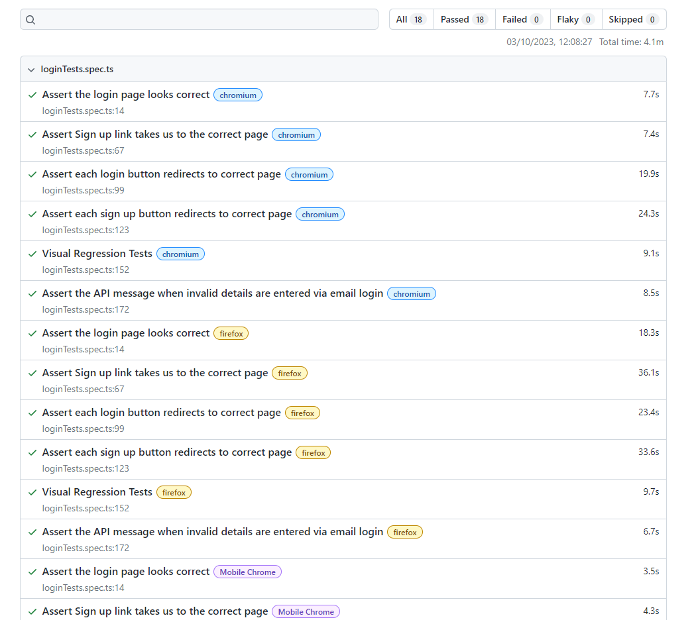
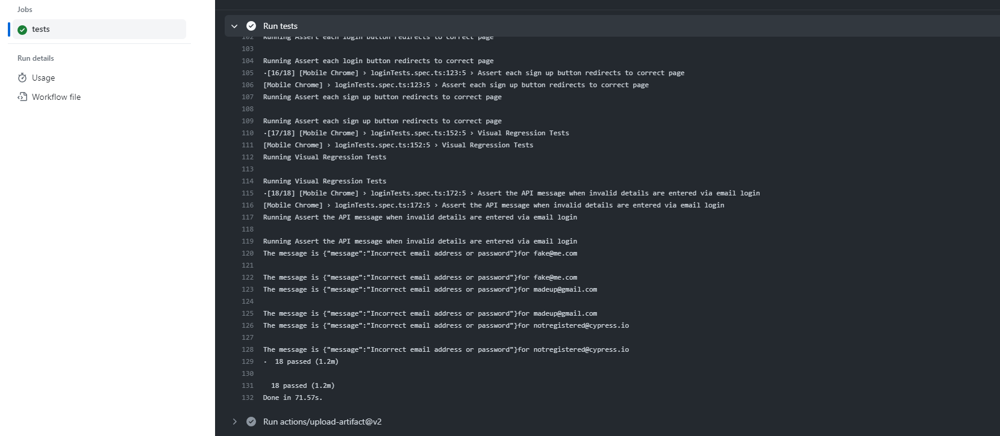

# Playwright Task - Michael Robson

Repository for the V7 QA Automation Engineer Challenge - adds some basic Playwright tests for https://cloud.cypress.io/login

### How The Project Works

This project uses yarn to handle dependencies and the scripts needed to run the tests along with other useful scripts we might want to use for linting, pre-commit hooks or generating screenshots used for the visual tests.

Scripts and dependencies can be found in `package.json`

### How The Playwright Tests Works

The Playwright framework uses the page object modal to make maintaining tests as easy as possible. The pages are stored in `e2e\pages`

Tests are stored in `e2e\tests`

A HTML test report is generated after each run in `e2e-test-report`

Custom commands that don't relate to a page object are added to `e2e\common-steps.ts`

Global configuration is set in `playwright.config.ts` this includes reporter configraution and the base URL

The project is set to run each test against three different browsers:

- Chrome Desktop
- Firefox Desktop
- Chrome Mobile Pixel 5

### Scripts We Can Run

yarn lint - Runs eslint check on all Playwright files
yarn prettier:check - Reports on any formatting issues
yarn format - Fixes any formatting issues
yarn lint:fix - Fixes any linting issues
yarn beforePR - Runs both lint and format fix jobs
yarn allTestsHeadless - Run the full test suite in headless mode
yarn allTests - Runs the full test suite in headed mode (User will see browser appear on screen)
yarn generateScreenshotForVisualTest - Saves new screenshots for the visual tests, these could then be pushed to the repo if the suite will run on that browser + OS combination often

### Dev Dependencies Used

- [Playwright](https://playwright.dev/) - The test framework
- [eslint](https://eslint.org/) - Finds and fixes problems in JavaScript code
- [eslint-config-prettier](https://github.com/prettier/eslint-config-prettier) - Turns off all rules that are unnecessary or might conflict with Prettier.
- [eslint-plugin-playwright](https://github.com/playwright-community/eslint-plugin-playwright#readme) - Adds Playwright rules to eslint
- [prettier](https://prettier.io/) - A code formatter
- [typescript](https://github.com/Microsoft/TypeScript) - TypeScript is a language for application-scale JavaScript.
- [typescript-eslint/parser](https://github.com/typescript-eslint/typescript-eslint) - Allows eslint to run against TypeScript files
- [typescript-eslint/eslint-plugin](https://github.com/typescript-eslint/typescript-eslint) - Add TypeScript rules to eslint
- [husky](https://typicode.github.io/husky/) - Improves commits by allowing you to run linting or tests before a push to a branch
- [lint-staged](https://github.com/okonet/lint-staged) - Runs linting before a commit, works in conjunction with husky

### Linting

Linting is the process of performing static analysis on source code to flag patterns that might cause errors or other problems. As an application progresses through the various stages of development, code quality becomes critical.

In this project we are linting with the Playwright recommended ruleset and TypeScript ruleset we are also running Prettier to make sure all code is formatted to the same standard.

Using husky and lint-staged I've created a pre-commit job in `.husky\pre-commit` which runs the lint-staged job found in `package.json`

     "lint-staged": {
        "*.{js,jsx,ts,tsx}": "yarn lint:fix",
       "*.{js,jsx,ts,tsx,scss,css,json,md}": "yarn format"
      },

This means whenever a git commit occurs we are running the two lint tasks found in `package.json` that format all the code using eslint and then format all the code with prettier, if any issues can't be automatically fixed you will receive an error message and the commit won't be pushed.

### Proof Of Tests Passing

Locally:

Pipeline: https://github.com/Michael-Robson/PlaywrightTask/actions/runs/6392235487

### NOTES

The suite contains a visual test, visual tests in Playwright require an image to compare against. In this repo I have added images for my local setup and the Github pipeline, if you want to run the tests locally you will first need to run the `yarn generateScreenshotForVisualTest` script to generate screenshots based on your OS & browser combination. After this you can run `yarn allTests` and the tests will use your local screenshots for comparisons.
